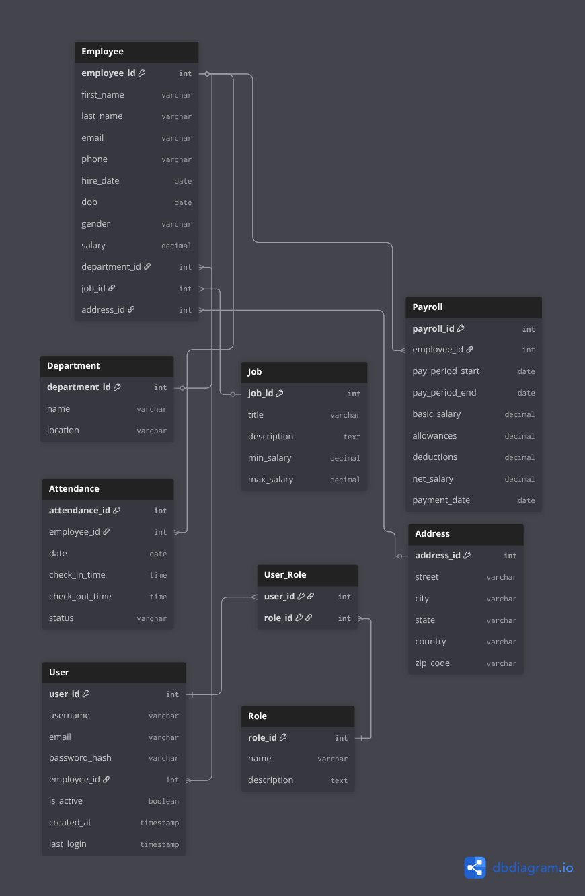

# EMS

A Spring Boot–based application for managing employees, attendance, payroll, and related operations.
This project demonstrates integration with RFID readers [via JSerialComm](https://fazecast.github.io/jSerialComm/) to enable automated check-in and check-out.

## 📌 Features

* 👨‍💼 Employee management (CRUD)
* 🕒 Attendance tracking :
  * Check-in / check-out simulation
  * Automatic alternation between IN and OUT based on RFID scans

---

* Department & Job Management
  * Manage organizational departments and job roles.

---

* 📡 Hardware integration with RFID reader (USB/Serial):
  * The system listens to scans from a connected RFID reader.
  * Each scan is linked to an employee via their RFID tag.
  * The system automatically alternates:
    * First scan of the day → ✅ Check-in
    * Next scan → ✅ Check-out

---

* Payroll Management
  * Generate payroll records for employees.
  * Automatic payment date handling with timestamps.

---

## 📊 Entity Relationship Diagram (ERD)

  
## 🛠️ Tech Stack

* Backend: Spring Boot, Spring Data JPA, Hibernate
* Database: PostgreSQL
* Build Tool: Maven
* Java Version: OpenJDK 21+
* Lombok: To reduce boilerplate code
* Testing: JUnit + Mockito (planned)
* jSerialComm (2.9.3) for RFID reader integration

## 🔮 Future Enhancements

* Authentication & Role-based Access (Spring Security + JWT)
* Pagination & Filtering for Employee listing
* Advanced Payroll Reports
* Dockerization for easy deployment
* CI/CD pipeline integration

## 👨‍💻 Author

### Eustache Kamala

#### Backend Developer | Fullstack Learner | Cloud Enthusiast
