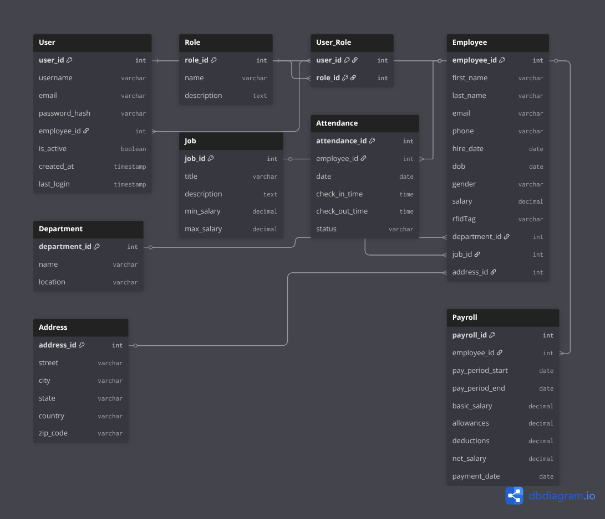

# EMS
A Spring Boot 3.5.5 based Employee Management System designed to manage employees, departments, jobs, payroll, and attendance records. 
The project demonstrates clean architecture with JPA/Hibernate, DTOs, and relational mapping between entities.

## 📌 Features
* Employee Management:
  * Add, update, delete, and view employees.
  * Associate employees with departments, jobs, and addresses.
---
* Department & Job Management
  * Manage organizational departments and job roles.
---
* Attendance Tracking
  * Record employee check-in/check-out times.
  * Track attendance status per day.
---
* Payroll Management
  * Generate payroll records for employees.
  * Automatic payment date handling with timestamps.
---
* Relational Database Design
  * One-to-Many: Department → Employees
  * Many-to-One: Employee → Job
  * One-to-One: Employee ↔ Address
  * One-to-Many: Employee → Attendance
  * Many-to-One: Employee ↔ Payroll
---
## 📊 Entity Relationship Diagram (ERD)

  
## 🛠️ Tech Stack
* Backend: Spring Boot (3.5.5), Spring Data JPA, Hibernate
* Database: PostgreSQL
* Build Tool: Maven
* Java Version: OpenJDK 21+
* Lombok: To reduce boilerplate code
* Testing: JUnit + Mockito (planned)

## 🔮 Future Enhancements
* Authentication & Role-based Access (Spring Security + JWT)
* Pagination & Filtering for Employee listing
* Advanced Payroll Reports
* Dockerization for easy deployment
* CI/CD pipeline integration

## 👨‍💻 Author
### Eustache Kamala
#### Backend Developer | Fullstack Learner | Cloud Enthusiast
